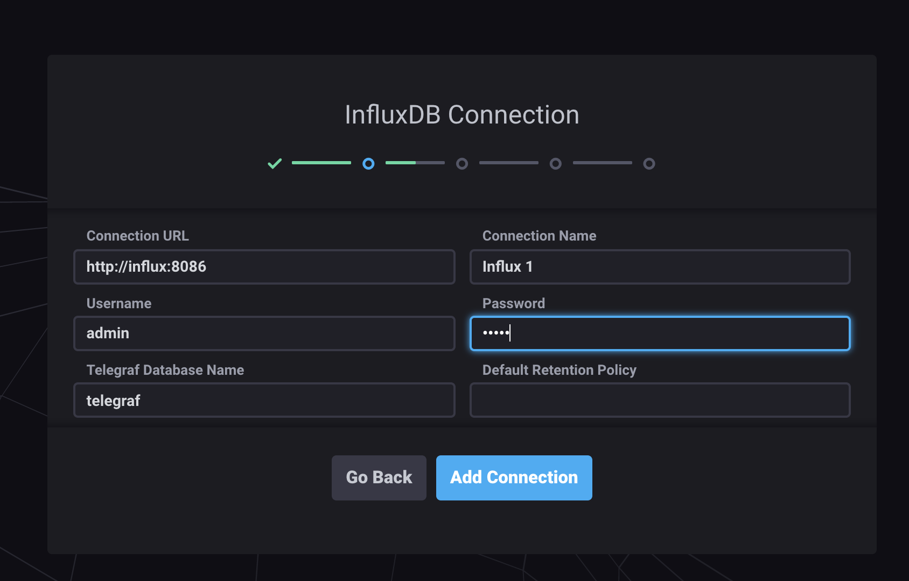
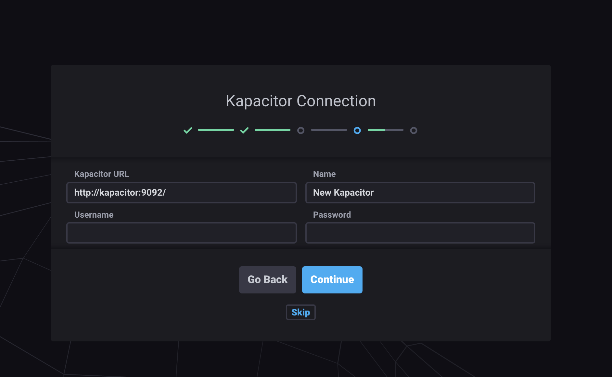
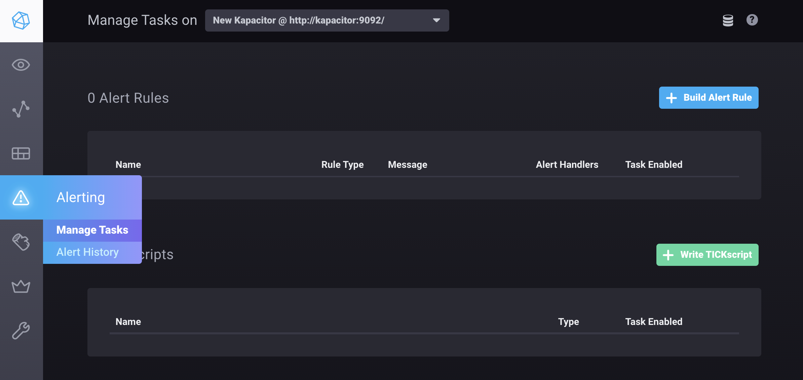
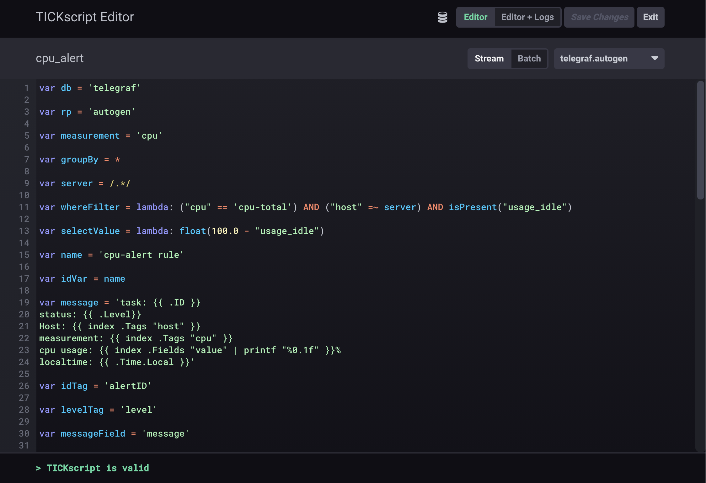
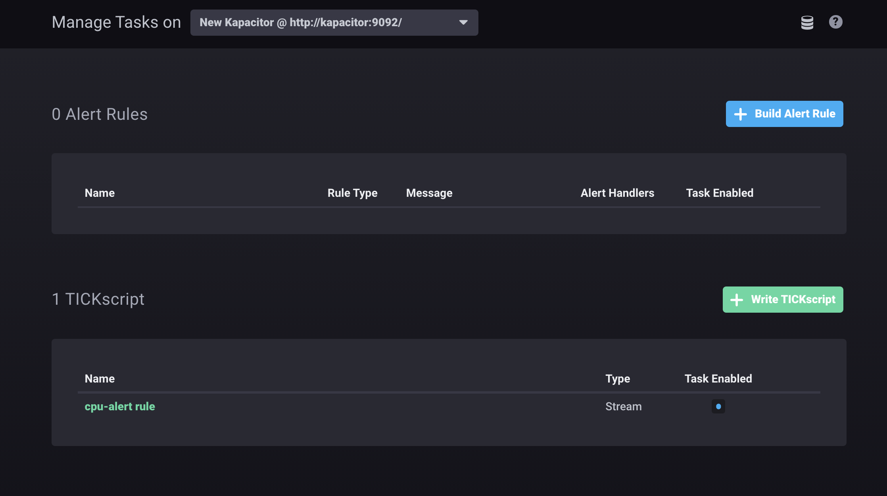
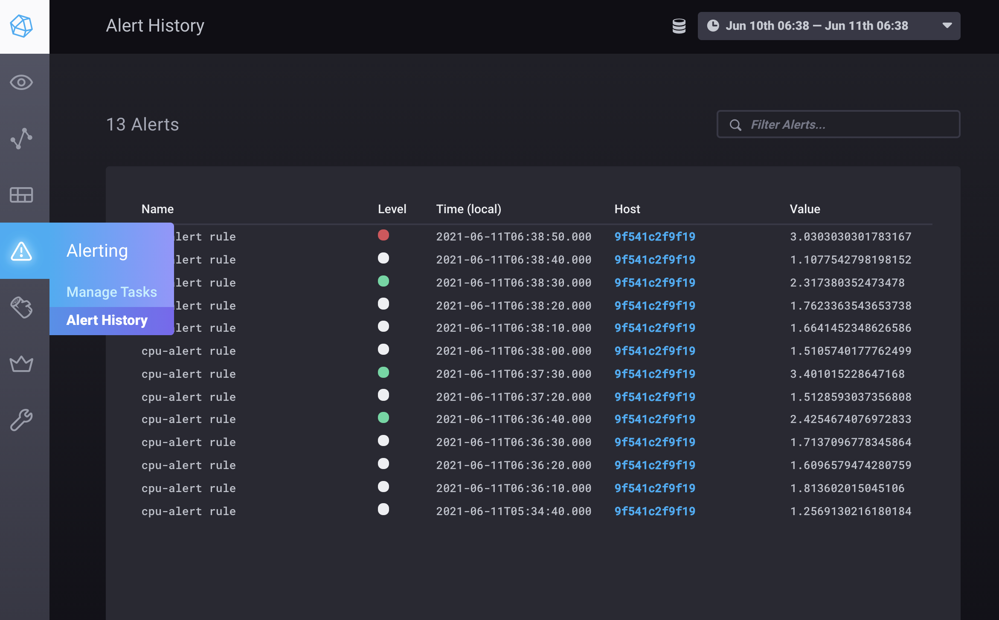
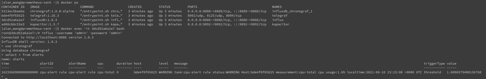

# TICK-stack

## 👨‍💻簡介
🔰ELFK-stack：使用docker-compose建立起tick-stack的架構，撈取的指標從config/telegraf.conf設定，並送往influxdb從起來，chronograf為ui介面，查看撈取的時間序列指標狀態，最後kapacitor則是處理告警的部分．

## 流程
- ⚙️TICK-stack : telrgraf(送資料) -> influxdb(存資料) -> chronograf(ui) -> kapacitor(alert)

## 環境建置
### telegraf設定
使用telegraf.conf設定輸出資料庫
```conf
[[outputs.influxdb]]
  urls = ["http://influxdb:8086"]
  database = "telegraf" # 要使用的資料庫
  username = "admin"
  password = "admin" 
  ```
### influxdb設定
使用configuration.env設定帳密以及資料庫
```conf
# InfluxDB options
INFLUXDB_DB=telegraf
INFLUXDB_ADMIN_USER=admin
INFLUXDB_ADMIN_PASSWORD=admin
```
### kapacitor設定
使用kapacitor.conf
* 設定讀取的資料庫
```conf
[[influxdb]]
  enabled = true
  name = "telegraf"
  default = false
  urls = ["http://influxdb:8086"]
  username = "admin"
  password = "admin"
```
* 設定告警telegram
```conf
[telegram]
  enabled = true
  url = "https://api.telegram.org/bot"
  token = "bot-token"
```
### 啟動環境
```shell
docker-compose up
```
接著去本地chronograf `http://IP:8888`
設定influxdb以及kapacitor
* http:// IP :8086 for influxdb
* http:// IP :9092 for kapacitor



## 告警設計
參考cpu_alert.tick.example
## 使用告警
### 透過kapacitor
```shell
cd /var/lib/kapacitor
# cpu_alert為任務task_id
# 定義任務
kapacitor define cpu_alert -tick cpu_alert.tick -type stream -dbrp telegraf.autogen
# 啟動任務
kapacitor enable cpu_alert
# 停止任務
kapacitor disable cpu_alert
# 刪除任務
kapacitor delete tasks cpu_alert
# 列出所有任務
kapacitor list tasks
```
### 透過chronograf

選到左邊的alerting -> write TICKscript

輸入task_id -> 把script貼上 -> 選擇類型為stream -> 選擇db -> 按下儲存後下方會判斷script是否正常

完成後可回到manage task管理當前task 可透過點擊enabled下方圓點一鍵啟動/停用任務

alert history可查看告警訊息
* green:OK 
* white:INFO,WARN 
* red:CRIT


============================

### 查看alert寫回db訊息


### 參考資料
* https://github.com/sz9751210/docker-telegraf-influx-grafana-stack
* https://www.influxdata.com/time-series-platform/kapacitor/
* https://tanjiti.github.io/2018/12/18/%E5%BC%80%E6%BA%90kapacitor%E6%93%8D%E4%BD%9C%E6%89%8B%E5%86%8C/


